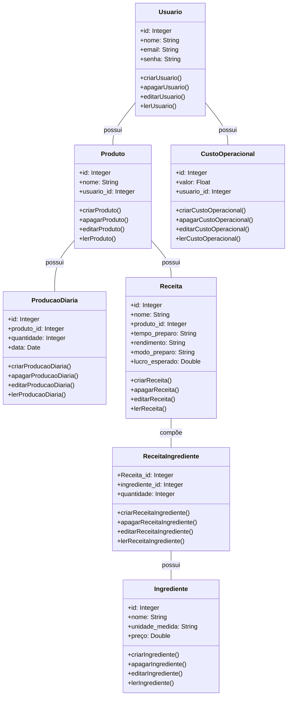

# receitasPlus

```mermaid
classDiagram
    Usuario -- Produto : possui
    Usuario -- CustoOperacional : possui
    Produto -- ProducaoDiaria : possui
    Produto -- Receita : possui
    Receita -- ReceitaIngrediente : compõe
    ReceitaIngrediente -- Ingrediente : possui
    class Usuario {
        +id: Integer
        +nome: String
        +email: String
        +senha: String
        +criarUsuario()
        +apagarUsuario()
        +editarUsuario()
        +lerUsuario()
    }
    class Produto {
        +id: Integer
        +nome: String
        +usuario_id: Integer
        +criarProduto()
        +apagarProduto()
        +editarProduto()
        +lerProduto()
    }
    class ReceitaIngrediente {
        +Receita_id: Integer
        +ingrediente_id: Integer
        +quantidade: Integer
        +criarReceitaIngrediente()
        +apagarReceitaIngrediente()
        +editarReceitaIngrediente()
        +lerReceitaIngrediente()
    }
    class ProducaoDiaria {
        +id: Integer
        +produto_id: Integer
        +quantidade: Integer
        +data: Date
        +criarProducaoDiaria()
        +apagarProducaoDiaria()
        +editarProducaoDiaria()
        +lerProducaoDiaria()
    }
    class Receita {
        +id: Integer
        +nome: String
        +produto_id: Integer
        +tempo_preparo: String
        +rendimento: String
        +modo_preparo: String
        +lucro_esperado: Double
        +criarReceita()
        +apagarReceita()
        +editarReceita()
        +lerReceita()
    }
    class CustoOperacional {
        +id: Integer
        +valor: Float
        +usuario_id: Integer
        +criarCustoOperacional()
        +apagarCustoOperacional()
        +editarCustoOperacional()
        +lerCustoOperacional()
    }
    class Ingrediente {
        +id: Integer
        +nome: String
        +unidade_medida: String
        +preço: Double
        +criarIngrediente()
        +apagarIngrediente()
        +editarIngrediente()
        +lerIngrediente()
    }
```
